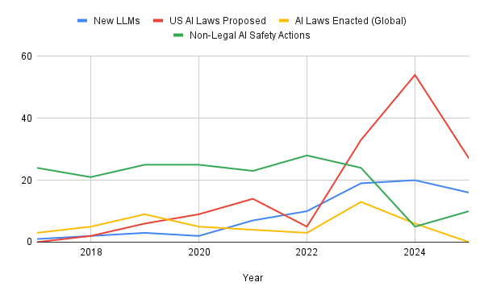
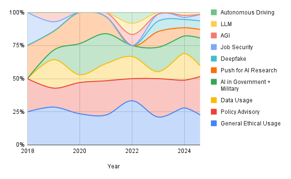
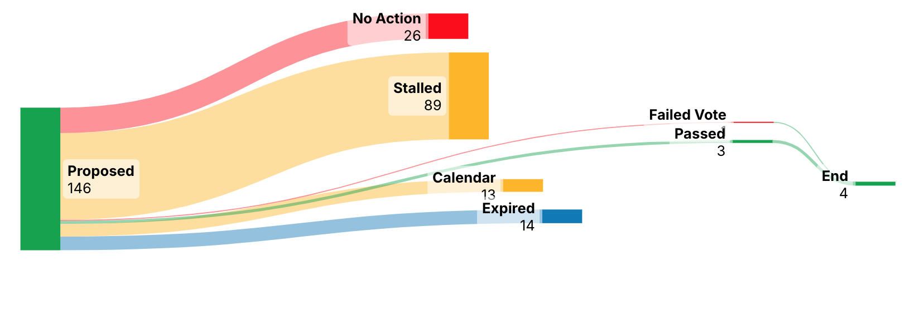

# Position: Bridging the AI Development–Regulation Gap Requires Dedicated Committees and Adaptive Legislation

This repository contains the dataset, analysis code, and results for our study on **bridging the gap between AI development and AI safety regulation in the United States**, accepted at **ICML 2026**.

## 📄 Paper

**Title:** *Position: Bridging the AI Development–Regulation Gap Requires Dedicated Committees and Adaptive Legislation*
**Authors:** Mansur Ali Khan, Mehmet Efe Akengin, Osman Salahuddin, Ahmad Rushdi
**Venue:** Proceedings of the 43rd International Conference on Machine Learning (ICML), Seoul, South Korea. PMLR 306, 2026.

## 📘 Introduction

While AI models advance at unprecedented rates, **AI safety legislation in the United States remains largely stalled or unrealized**.

We argue that bridging the AI development–regulation gap **requires dedicated AI committees and adaptable, pre-emptive legislation informed by all stakeholders**. We support this position with a technical analysis of U.S. AI-related bills introduced from 2017 to 2025.

> **The bottleneck is not proposals — it is procedure.**
> Only **4.23%** of U.S. AI bills reach any terminal outcome (6.25% for general bills), and stalling happens at *stage-specific* points in the legislative pipeline.

This work introduces a **Sequential Binary Hurdle Model** that separates the predictors of *initial committee engagement* from those of *late-stage advancement*, revealing that **public-interest topics get bills in the door, but structural factors decide whether they advance**.

<p align="center">
  
  <br>
  <em>Figure 1. Trajectory of LLM breakthroughs vs. AI regulation — the temporal acceleration asymmetry between AI capability releases and legislative action.</em>
</p>

## 🗂️ Repository Contents

| File | Description |
|------|-------------|
| `data_ordinal.csv` | Analytical dataset of 124 U.S. Congressional AI bills with terminal outcomes, sub-field labels, and structural metadata. |
| `sequential_hurdle_analysis.py` | Self-contained script that fits the two-stage hurdle model, bootstraps inference, and reports train/test accuracy. |
| `sequential_hurdle_results.csv` | Output: bootstrapped coefficient summary (means, p-values, FDR Q-values, 95% CIs) plus per-stage train/test accuracy. |

## ⚙️ Methodology

### **Dataset Construction**

We assemble the **first comprehensive dataset of U.S. AI bills (2017–2025, N = 150)**, aggregated from Congress.gov and manually annotated for legislative endpoint and AI sub-field. Sub-fields were classified with GPT-4o and human-audited (94% accuracy on a 50-bill spot check). Bills are mapped to a 3-level ordinal outcome:

- **0 — Inaction (Expired):** expired without meaningful action
- **1 — Processed (Stalled in Committee):** received committee action but stalled
- **2 — Advanced (Calendar / Resolved):** progressed beyond committee

The 26 bills from the ongoing 119th Congress are excluded (outcomes not yet observable), leaving **124 terminal bills** for modeling.

### **Action Rate Metric**

To quantify congressional engagement we use the *Action Rate*:

```
Action Rate = (Passed Bills + Failed Bills) / Total Proposed Bills
```

### **Sequential Binary Hurdle Model**

Rather than treating stalling as one binary outcome, we model two conditional thresholds:

- **Hurdle 1 — Engagement Gate:** Inaction (0) vs. Any Action (1 or 2)
- **Hurdle 2 — Advancement Gate:** Stalled (1) vs. Advanced (2), conditional on clearing Hurdle 1

Each stage is an independent **ridge (L2) penalized logistic regression** (`C = 1.0`, `solver = lbfgs`, `class_weight = balanced`) over **12 features** — number of sponsors, chamber of origin, sponsor party, bipartisan status, and policy sub-field indicators. Low-frequency sub-fields (LLM, AGI, Autonomous Driving) are grouped into a single **Advanced AI** category for stability.

Inference uses **bootstrap resampling (1000 iterations)**: each iteration resamples the data with replacement to form the training set, and the bills **not drawn (out-of-bag, ≈37%)** form the held-out test set. Reported coefficients are bootstrapped means; p-values come from z-scores on bootstrapped standard errors. Features are z-scored with `StandardScaler`, and multiple comparisons are controlled with the **Benjamini–Hochberg False Discovery Rate (FDR)** at α = 0.05.

## 📈 Key Findings

<p align="center">
  
  <br>
  <em>Figure 2. Sub-fields of proposed AI legislation in the U.S.</em>
  <br><br>
  
  <br>
  <em>Figure 3. Path of bills by volume — 89 of 150 proposed bills stall at the committee stage.</em>
</p>

**Hurdle 1 (Engagement Gate)** — public-interest sub-fields drive initial engagement:

| Feature | Coefficient | p-value | FDR Q |
|---------|------------:|--------:|------:|
| Deepfake | 1.5536 | 1.21×10⁻⁶ | 2.91×10⁻⁵ |
| Job Security | 1.2298 | 0.0005 | 0.0056 |

**Hurdle 2 (Advancement Gate)** — the pattern reverses; structural factors dominate (significant at p < 0.05, though not surviving FDR):

| Feature | Coefficient | p-value |
|---------|------------:|--------:|
| Number of sponsors | −0.9765 | 0.0102 |
| Chamber of origin | −1.0693 | 0.0416 |

**Bootstrapped accuracy (mean ± std over 1000 trials):**

| Stage | Train Accuracy | Test Accuracy (out-of-bag) |
|-------|:--------------:|:--------------------------:|
| Hurdle 1 (any action vs. expired) | 0.7681 ± 0.0540 | 0.6455 ± 0.0779 |
| Hurdle 2 (advanced vs. stalled) | 0.7702 ± 0.0518 | 0.6363 ± 0.0715 |

## ▶️ Reproducing the Results

```bash
pip install numpy pandas scipy scikit-learn statsmodels
python sequential_hurdle_analysis.py
```

The script reads `data_ordinal.csv` and writes `sequential_hurdle_results.csv` (and prints the accuracy summary). The run is deterministic (seed = 42).

## 📌 Recommendations

**1. Establish dedicated AI-policy committees**
Concentrated AI expertise reduces the committee-level stalling that ends most bills.

**2. Create independent AI safety oversight agencies**
Empowered to regulate AI systems, audit compliance, and intervene proactively.

**3. Adopt adaptive, pre-emptive legislation**
Policies should anticipate AI risk thresholds rather than react after harm.

**4. Introduce sunset clauses**
A 5-year sunset with review at the 3-year mark keeps regulation current and lowers the political cost of enactment.

## 🔗 Citation

If you use this work, please cite:

```bibtex
@inproceedings{khan2026bridging,
  title={Position: Bridging the AI development-regulation gap requires dedicated committees and adaptive legislation},
  author={Khan, Mansur Ali and Akengin, Mehmet Efe and Salahuddin, Osman and Rushdi, Ahmad},
  booktitle={Proceedings of the 43rd International Conference on Machine Learning (ICML)},
  series={Proceedings of Machine Learning Research},
  volume={306},
  year={2026},
  publisher={PMLR}
}
```
